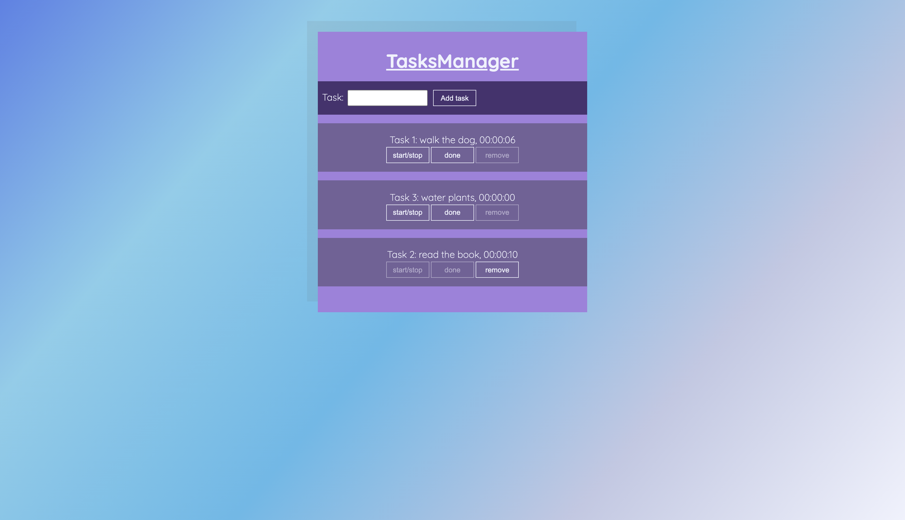

# devmentor.pl - React: Components

## Table of contents

-   [Overview](#overview)
    -   [The challenge](#the-challenge)
    -   [Screenshot](#screenshot)
    -   [How to run the project](#how-to-run-the-project)
-   [My process](#my-process)
    -   [Built with](#built-with)
    -   [What I learned](#what-i-learned)
    -   [Continued development](#continued-development)
    -   [Useful resources](#useful-resources)
-   [Author](#author)
-   [Acknowledgments](#acknowledgments)

## Overview

### The challenge

The goal of this task was to create an app with the functionality of Task Manager. The user should be able to add a task with chosen name using a form. A "start/stop" button has toggle functionality that starts or stops the timer that counts from 0. The timer should be displayed in 00:00:00 format. The button "done" stops the timer, enables the "remove" button, and pushes the task to the bottom of the display. The "remove" button removes the task from the display but keeps it inside the state array. The app uses a local API to store and update a task's information.

### Screenshot

### How to open project

1. Clone git repository and open file on your local device in Code editor.
2. Run `npm install` command to install all npm packages.
3. Run `json-server --watch ./db/data.json --port 3005` command.
4. Run `npm start` command to open developer mode.

Localhost port: `http://localhost:8080/index.html`

## My process

### Built with

-   React
-   CSS
-   Flexbox
-   Webpack

### What I learned

During coding this challenge I had a chance to get a basic understanding of React. I had a chance to build a controlled form component and practice using and updating the state. I learned that state should never be mutated and mutating does not trigger re-render in React. Instead of assignment operator we should always use [setState()](https://css-tricks.com/understanding-react-setstate/) method. This method is asynchronous and does not mutate the original state. Because of this, we can track changes. In this task, I did not split my code into components on purpose to not over complicated it at the moment of writing. I refreshed my knowledge about API and intervals and put it into use in React. Another important lesson was to practice working with [events](https://css-tricks.com/working-with-events-in-react/) in React.

### Continued development

I will keep learning React, soon I will refactor my Task Manager into separate components.

### Useful resources

-   [Official React website](https://reactjs.org/docs/getting-started.html) - Documentation. Every question regarding React answered.
-   [CSS Tricks](https://css-tricks.com/tag/react/) - Articles with React tag.

## Author

-   Website - [Axseinga](https://www.your-site.com)
-   Frontend Mentor - [@Axseinga](https://www.frontendmentor.io/profile/yourusername)
-   LinkedIn - [Agnieszka Urbanowicz](https://www.linkedin.com/in/agnieszka-urbanowicz-051147151/)

## Acknowledgments

Thanks to my [Mentor - devmentor.pl](https://devmentor.pl/) - for providing me with this task and for code review.
